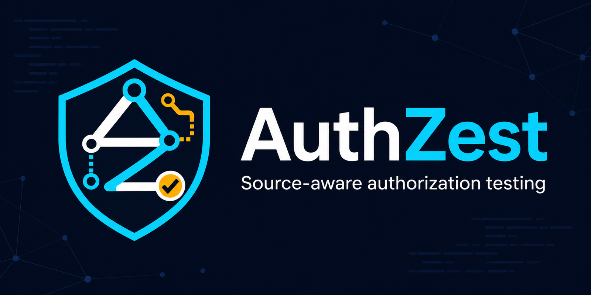

<p align="center">
  
</p>

<p align="center">
  <a href="../../README.md">English</a> ·
  <a href="README.ko.md">한국어</a> ·
  <a href="README.ja.md">日本語</a> ·
  <strong>Русский</strong>
</p>

# AuthZest

AuthZest — это инструмент с открытым исходным кодом для тестирования безопасности авторизации в проектах
FastAPI с учётом структуры исходного кода. Он анализирует структуру репозитория и объявления маршрутов,
создавая доказательства для будущих детерминированных правил и необязательного анализа с помощью ИИ.

> [!IMPORTANT]
> AuthZest находится на ранней стадии разработки. Версия `0.1.0` — это запускаемый каркас проекта, а не
> завершённый сканер уязвимостей. Классификация авторизации, формирование результатов безопасности,
> активное тестирование и анализ с помощью Codex пока только запланированы.

## Что уже работает

- Поиск распространённых декораторов маршрутов FastAPI с помощью Python AST
- Команды Typer CLI: `scan`, `doctor` и `ui`
- Результаты сканирования в JSON и удобочитаемом виде
- Endpoint для проверки состояния FastAPI и сканирования репозитория
- Необязательная локальная панель React/Vite, работающая на localhost
- Сборка единого исполняемого файла с помощью PyInstaller
- Разделённые границы модулей `analyzer`, `parser`, `runner` и `codex`
- Проверки Python и frontend в GitHub Actions

Adapter Codex сейчас отключён. Для локального анализа не требуются API key или вход в ChatGPT.

## Установка с помощью pipx

Для AuthZest требуется Python 3.12 или новее.

```bash
git clone https://github.com/casing1/authzest.git
cd authzest
pipx install .

authzest --version
authzest doctor
authzest scan /path/to/fastapi-project
```

Чтобы установить необязательную локальную панель, используйте `pipx install '.[ui]'`. Для повторной
установки текущей версии во время разработки используйте `pipx install . --force`.

## Среда разработки

```bash
python3.12 -m venv .venv
source .venv/bin/activate
python -m pip install -e '.[dev]'

cd frontend
npm ci
cd ..
```

## CLI

```bash
authzest --help
authzest --version
authzest doctor
authzest scan <path>
authzest scan <path> --json
authzest ui --workspace <path> --host 127.0.0.1 --port 8000
```

Команда `doctor` проверяет среду выполнения, а также необязательную установку Codex CLI и состояние входа.
Статический анализ продолжает работать, даже если Codex недоступен.

Команда `scan` пока подсчитывает файлы Python и находит декораторы маршрутов FastAPI: `get`, `post`, `put`,
`patch`, `delete`, `options` и `head`. Она ещё не определяет, безопасно ли настроена авторизация endpoint.

## Необязательная локальная панель

Панель работает как локальное приложение и не требует публикации веб-сайта.
HTTP API может сканировать только выбранную workspace. Прямое сканирование через CLI по-прежнему может
использовать любой путь, доступный текущему пользователю для чтения.

```bash
cd frontend
npm ci
npm run build
cd ..

authzest ui --workspace .
```

Откройте `http://127.0.0.1:8000`. При разработке frontend запускайте `authzest ui --reload` и
`npm run dev` в отдельных терминалах. Vite перенаправляет `/api` и `/health` на локальный сервер FastAPI.

## Локальный API

- `GET /health` — состояние backend
- `GET /api/health` — аналогичный endpoint для frontend
- `POST /api/scans` — сканирование workspace, выбранной при запуске сервера; путь в теле запроса не принимается
- `GET /docs` — документация API, созданная FastAPI

## Проверка

```bash
pytest
ruff check .
ruff format --check .

cd frontend
npm run lint
npm run format:check
npm run build
```

## Единый исполняемый файл

```bash
source .venv/bin/activate
python -m pip install -e '.[build]'
cd frontend && npm ci && npm run build && cd ..
python -m PyInstaller --clean --noconfirm authzest.spec
./dist/authzest doctor
```

При отправке тега `v*` запускается release workflow, который создаёт исполняемые файлы для macOS, Linux и
Windows вместе с контрольными суммами SHA-256.

## Структура проекта

```text
.
├── src/authzest/
│   ├── analyzer/        # Анализ и агрегация на уровне репозитория
│   ├── parser/          # Разбор исходного кода языка и фреймворка
│   ├── codex/           # Interface и реализации необязательного AI adapter
│   ├── runner/          # Orchestration процесса анализа
│   ├── api/             # Transport FastAPI
│   ├── cli.py           # Transport Typer CLI
│   └── models.py        # Модели данных core
├── tests/
├── frontend/            # Необязательный UI на React/Vite/TypeScript
├── docs/                # План разработки и материалы бренда
├── scripts/             # Инструменты упаковки release
├── authzest.spec        # Конфигурация PyInstaller
└── .github/workflows/   # CI и release workflow
```

Зависимости направлены внутрь от CLI, API и UI к core. Core не должен зависеть от веб-сервера, React или
конкретного AI provider.

## План развития и участие

- [План разработки](../DEVELOPMENT_PLAN.md)
- [Публичный roadmap issue](https://github.com/casing1/authzest/issues/1)
- [Правила участия и коммитов](../../CONTRIBUTING.md)

Перед реализацией создайте issue и используйте связанную с ним краткосрочную ветку. До слияния pull request
должен пройти проверки Python и frontend.

## Лицензия и безопасность

AuthZest распространяется по [лицензии MIT](../../LICENSE). Сообщайте об уязвимостях через закрытую процедуру,
описанную в [SECURITY.md](../../SECURITY.md), а не через публичный issue.
